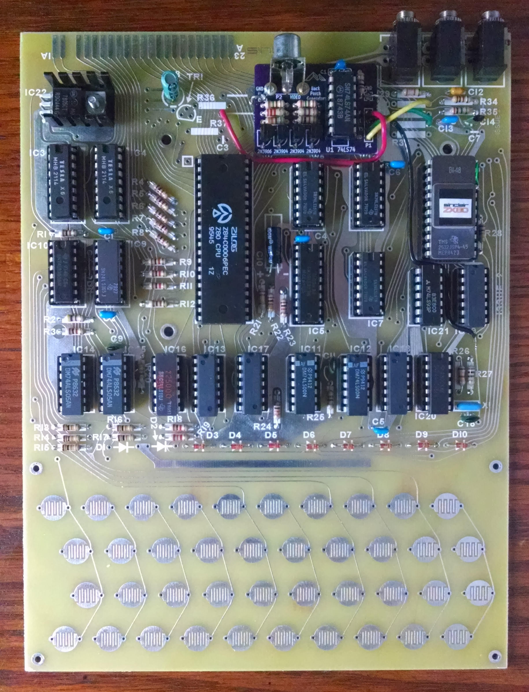

# zx80-back-porch-generator
 Back Porch Video Signal Generator for ZX80

## Description

This circuit modifies the Sinclair ZX80 video output signal and adds the "back porch" part of the synchronization pulse of the video signal, so that it can be used with modern TVs.

The circuit is build on a PCB that can be installed instead of the video modulator circuit.

